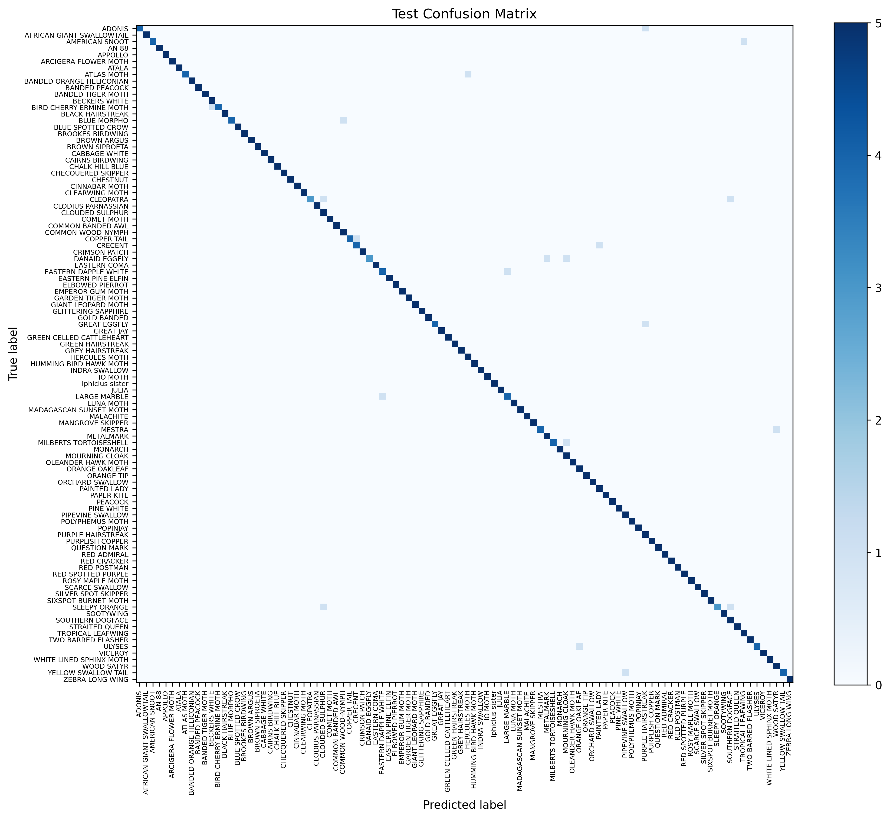
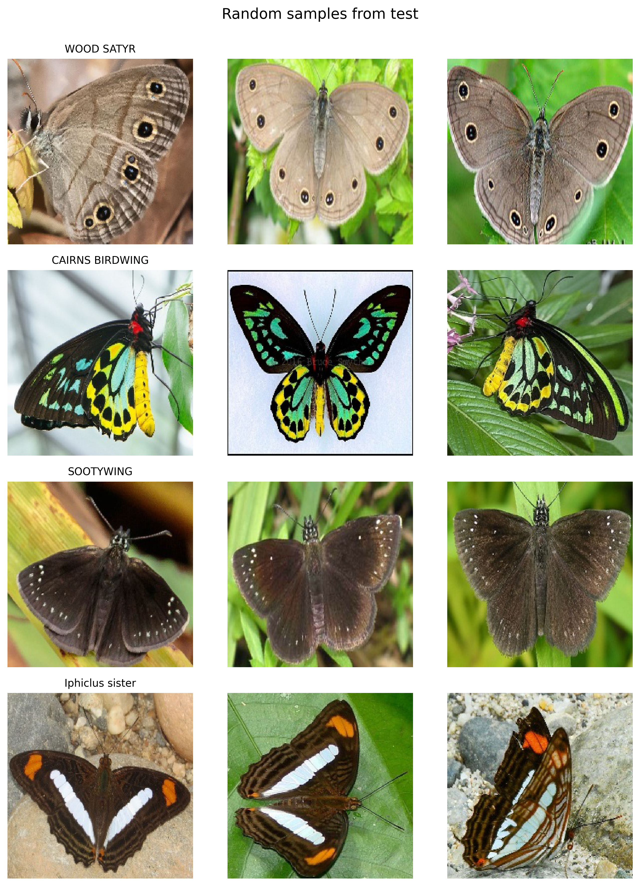
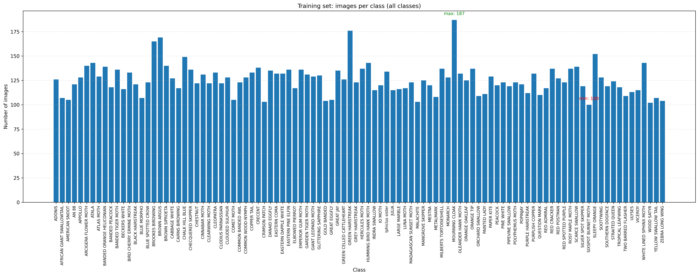

# Butterflies and Moths Classification with Swin Transformer

This project uses a Swin Transformer (`swin_tiny_patch4_window7_224`) to perform 100-class image classification on the Butterfly-100 dataset.


|Split|Top-1 Acc. (%)|Top-3 Acc. (%)|
|:-|:-:|:-:|
|Validation|94.60|99.60|
|Test|96.00|99.00|

Note on reproducibility:
- It is normal to see small Top-1/Top-3 differences across different machines or environments (e.g., different GPU/CUDA/cuDNN, `torch`/`torchvision`/`timm`/`pillow` versions, image resize implementation details, and non-deterministic GPU kernels). Treat the numbers above as reference results for the author’s environment.

## Quick Start

1) Install dependencies

```bash
pip install -U pip
pip install -r requirements.txt
```

Note: If you want a CUDA-enabled PyTorch build, install `torch`/`torchvision` following the official instructions at https://pytorch.org/ and then run `pip install -r requirements.txt`.

2) Train

```bash
python train.py
```

3) Test / Inference

```bash
python inference.py
```

Inference outputs are saved to `output/inference/` by default.

## Project Structure

```text
.
├─ datasets/
│  └─ Butterfly-100/
│     ├─ train/   # training split (one folder per class)
│     ├─ valid/   # validation split (one folder per class)
│     └─ test/    # test split (one folder per class)
├─ models/
│  └─ swin_butterfly_model.pth
├─ output/
│  ├─ dataset/    # dataset statistics (generated by optional scripts)
│  └─ inference/  # inference outputs (generated by inference.py)
├─ script/
│  ├─ check_dataset.py
│  └─ data_distribute.py
├─ train.py
└─ inference.py
```

## Dataset Requirements

Training/validation/testing are loaded via `torchvision.datasets.ImageFolder`, so your directory layout must be:

```text
datasets/Butterfly-100/
   train/
      CLASS_NAME_1/
         xxx.jpg
         ...
      CLASS_NAME_2/
         ...
   valid/
      CLASS_NAME_1/
         ...
   test/
      CLASS_NAME_1/
         ...
```

Notes:
- Class names come from folder names.
- The set/order of class folders should be consistent between train and test; otherwise `inference.py` will warn and may fall back to the test-set class order.

## Environment & Dependencies

- Python: recommended 3.9+ (any version that supports PyTorch + timm)
- Core dependencies:
   - `torch`, `torchvision`
   - `timm`
   - `numpy`, `pandas`
   - `scikit-learn` (confusion matrix / reports)
   - `matplotlib`
   - `tqdm`
   - `pillow`

Notes:
- `train.py` loads Swin-Tiny via `torch.hub.load("SharanSMenon/swin-transformer-hub:main", ...)`.
- The first run may require internet access to fetch hub code / weights cache.

## Training (train.py)

```bash
python train.py
```

Defaults:
- Dataset path: `./datasets/Butterfly-100`
- Epochs: 10
- Batch size: 128 (train), 32 (valid/test)
- Backbone frozen; only the classification head (`model.head`) is trained
- Loss: `timm.loss.LabelSmoothingCrossEntropy`
- Optimizer: AdamW(lr=1e-3)
- Scheduler: StepLR(step_size=3, gamma=0.97)

Outputs:
- Model checkpoint: `models/swin_butterfly_model.pth`
- Evaluation artifacts under `output/` (generated on validation and test splits):
   - `output/validation_confusion_matrix.png`
   - `output/validation_per_class_metrics.csv`
   - `output/validation_classification_report.txt`
   - `output/test_confusion_matrix.png`
   - `output/test_per_class_metrics.csv`
   - `output/test_classification_report.txt`

## Testing / Inference (inference.py)

```bash
python inference.py
```

Default paths:
- Model: `models/swin_butterfly_model.pth`
- Test split: `datasets/Butterfly-100/test`

Inference outputs (`output/inference/`):
- `detailed_predictions.csv`: per-sample true/pred labels and class names
- `class_accuracy_stats.csv`: per-class sample count, correct count, accuracy
- `summary.csv`: top-1/top-3 accuracy and basic summary

Extra console output:
- Top-1 / Top-3 accuracy
- Per-class accuracy table
- A text summary of the confusion matrix for the top-N classes (default N=10)
- Top 10 most common misclassification pairs



## Dataset Inspection & Distribution (Optional)

1) Generate class counts, histograms, and random sample grids for train/valid/test:

```bash
python script/check_dataset.py --root datasets/Butterfly-100 --output-dir output/dataset
```


2) Plot a bar chart for all training classes and save a short textual summary:

```bash
python script/data_distribute.py --root datasets/Butterfly-100
```


Outputs are written to `output/dataset/`.

## Troubleshooting

- Training/inference is slow: prefer running on GPU (`cuda`).
- First run stuck downloading: `torch.hub.load` needs internet access to fetch the hub repository/weights.
- `ModuleNotFoundError: sklearn`: install `scikit-learn`.
- Top-1/Top-3 differs from another machine: small differences can happen due to different GPU/CUDA/cuDNN and library versions, as well as resize/interpolation and other implementation details.


